# Entropy-of-abstracts-and-the-citations-

See the code in google colab :

Data Processing:
https://colab.research.google.com/drive/1ASyqHT2qz7NovhOpC2t2Aqp5l5sZ-FYP?usp=sharing

Data Analysis:
https://colab.research.google.com/drive/1IPdHIBtXQNyarv0BAmDKoDkYNwH6x35u?usp=sharing

This analysis investigates the relationship between the linguistic features of scientific abstracts and their likelihood of citation.

### Key Questions
1. Does higher word-form entropy in abstracts correlate with more citations?
2. Is lower POS-form entropy (more structured writing) associated with higher citation rates?

## Problems

#### How much information should be contained in an abstract to get citations? 
Do articles featuring abstracts with richer content tend to receive more citations?
Abstracts with more informational content may increase the likelihood of article usage. A researcher can find the most vital information without reading the entire article and quickly decide if the article is relevant to their work through a quick review of the abstract.

#### Operationalization: 
Richer content would mean higher word-form entropy. Is the word-form entropy higher in abstracts of the most cited academic papers compared to the least cited?

#### Is adherence to academic writing style crucial for obtaining citations?
Articles with abstracts written in a way familiar to readers may be favored. 
Adopting an 'academic style' in abstract writing might be preferable. Authors who are more “creative” in their abstracts might attract less attention. Articles with a simpler structure are likely to be more comprehensible and, therefore, more accessible to a wider audience.

#### Operationalization: 
The level of “creativity” is based on POS-form entropy (level of similarity between the structure of the sentences). Less creative abstract (= more syntactically regular) would mean a lower POS-form entropy. Is the POS-form entropy lower in abstracts of the most cited academic papers than in the least cited?

## Measures
Measures are based on the paper “Entropy in Different Text Type” by Chen, Liu, and Altmann (2017).

1. For informational content – word-form entropy / relative word-form entropy

Why?:
“Higher entropy indicates more information content carried by an entity and vice versa. As Popescu et al. (2009a, p. 183) find, entropy depends on the number of types (V) of linguistic entities abiding by the power law H =  a*(V^b), where a and b are parameters. V is the decisive factor that bridges over the richness of textual entities (in most common cases they are just words) and the degree of the uniform distribution. In addition, there is a positive correlation between entropy and the degree of richness, which means ‘high entropy means great richness’. If the entities are words, then high entropy means great vocabulary richness.”  (Chen et al., 2017, p. 4).

2. For syntactic regularities – Parts of speech-form entropy / relative POS-form entropy

Why?:
“From the linguistic point of view, lower relative entropy of POS-forms means more syntactic regularity, more stereotypical of the text type; while higher entropy indicates more syntactic freedom or variation, more peculiar of the text type. Narrative discourses like fiction, news, and essays generally enjoy more syntactic freedom than expository discourses like academic and official forms  (Chen et al., 2017, p. 8).”

## Hypotheses
There will be a difference in the word-form entropy and POS-form entropy between the most cited and the least cited abstracts.

## Calculations

“For calculating word entropy on different sentential positions, for example, initial-position words in the text type of news, it will be based on a set of:

$$
S = \{ s_1^{word}, \dots, s_n^{word} \}
$$  

A partial picture of the word frequency is presented in Table 3. It has 3,004 word tokens and 1,275 different word types. If we take the first word ‘he’’, whose rank and frequency is ‘1’ and ‘89’, respectively, with its relative frequency (p1= 89/3004 = 0.0296) and self-information (-log2 p1 = -log20.02963 =5.0769), we may get its entropy as p1log2p1 = 0.02963*(5.0769)= 0.15042. Thus the entropy for all initial-position words in news is 

$$
H_{A01} = - \sum_{r=1}^{1275} p_r \log_2 p_r = 9.1646
$$

 and its relative entropy is Hrel = H/log2  V = 9.1646/log2 1275= 0.8884. From an information theoretical point of view, ‘he’ with the highest entropy carries the least information, as it is the most predictable one in the initial position of news, while the 10 words from the bottom with the lowest entropy (occurring once, all are content words) carry more information, as they are more unpredictable and make the most semantic contribution among others” (Chen et al., 2017).

## Methods
1. Narrowing the scope of texts:
The abstracts from Nature and Scopus turned out to be the most available and rather easy to process.

1. **Data collection – scraping abstracts to create a dataset:**
   
   a. **Nature abstracts** scrapped from Nature’s website [Research articles | Nature](https://www.nature.com/nature/research-articles). 2841 positions (after preprocessing, and removing duplicates).
   
   b. **Non-Nature abstracts** scrapped from Scopus website [Scopus preview - Scopus - Sources](https://www.scopus.com/sources). 3420 positions (after preprocessing).

3. **Text processing and analysis – Python:**
   
   a. preprocessing

   b. calculating the entropy of words of the abstracts
   
   c. part of speech classification

   d. calculating the POS entropy of the abstracts

   e. calculating the word and POS-form entropy on sentential positions

   f. visualization

## Results
### Entropy of abstracts
#### Nature 2016-2019:
*Nature: relative word-form and POS-form entropy of the 100 most cited articles and the 100 least cited articles.*

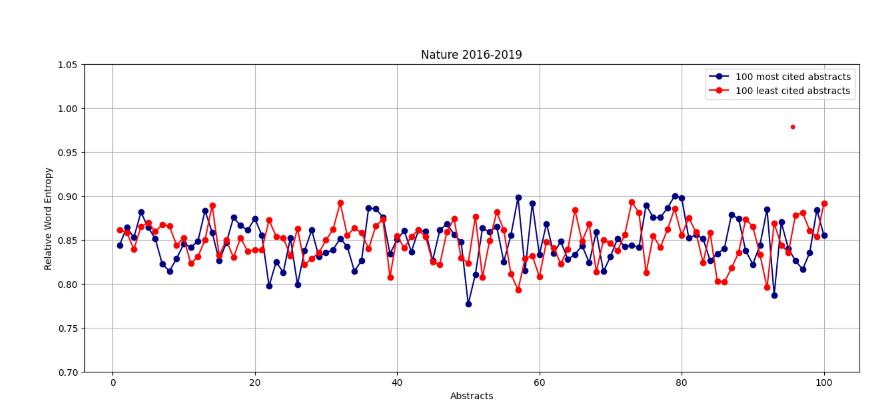

The word entropy is quite high for both the most and the least cited abstracts. Out of 200 compared abstracts, only a couple of them fall below 0.8, which suggests that abstracts in Nature are in general rich in terms of vocabulary. This outcome would be consistent with the expectations – choosing abstracts from only one renowned scientific journal can potentially skew the results due to the high standards and strict rules of admission.

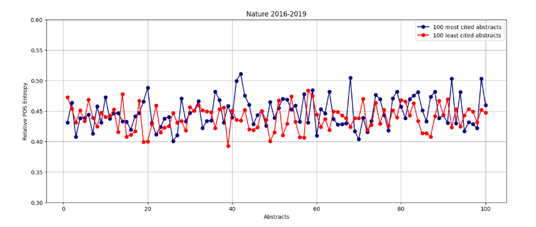

The POS entropy is mostly kept between 0.4 and 0.5, but it varies from abstract to abstract. There is no clear one-way trend – the entropy increases and decreases interchangeably for both the most and the least cited abstracts. However, the highest peaks of entropy belong to the most cited abstracts. That would suggest that the most cited Nature abstracts might be less syntactically regular than the least cited ones, pointing towards higher creativity.

#### Non-Nature Scopus 2016-2019:
*Non-Nature: relative word-form and POS-form entropy of the 100 most cited and the 100 least cited articles.*

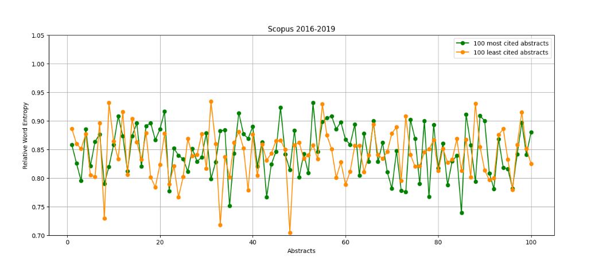

For the Scopus dataset, the word entropy is also rather high, indicating an overall rich vocabulary. In the case of Scopus, the values have a much wider range compared to Nature, but that could be expected because of the wider range of topics covered in those abstracts. The differences between the most and the least cited abstracts don’t seem to be notable– the lowest and highest values of entropy belong to both categories

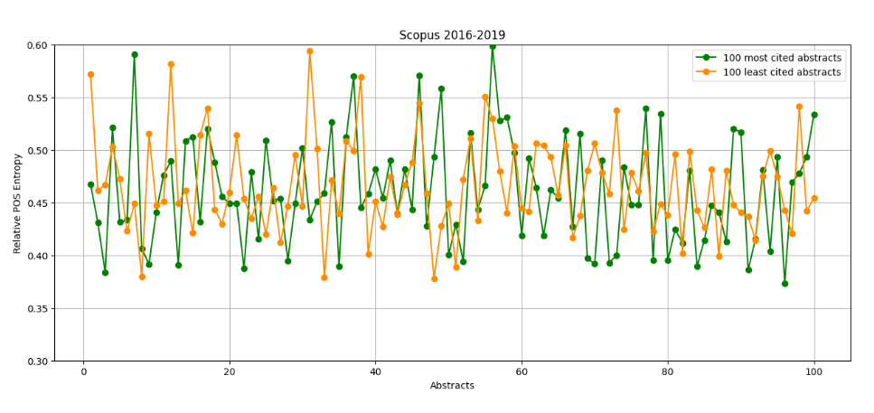

The POS entropy varies a lot for the Scopus abstracts, with values ranging from ~0.37 to 0.6 throughout the most and least cited positions. It can indicate that the Scopus abstracts differ from each other in terms of syntactic regularity, but there don’t seem to be any notable differences between the most and least cited abstracts.

#### Comparison – Non-Nature 2016-2019 (Scopus) and Nature 2016-2019, relative word-form and POS-form entropy:

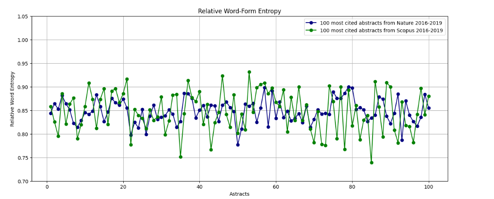
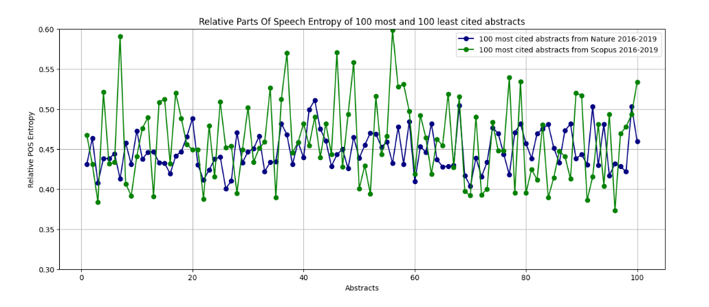

The comparisons above take into account only the most cited abstracts from Nature and Scopus datasets. There is a clear difference between the range of entropy values for the datasets.

### Entropy on sentential positions

*Nature: 100 most cited articles vs. 100 least cited articles*

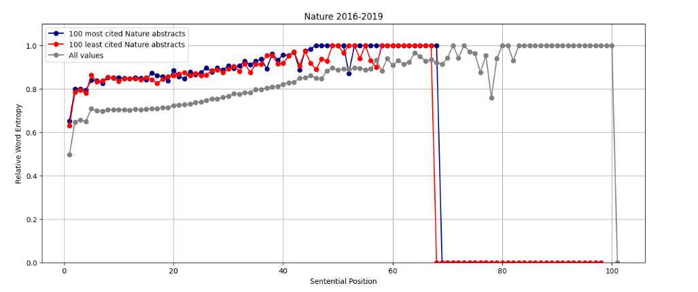
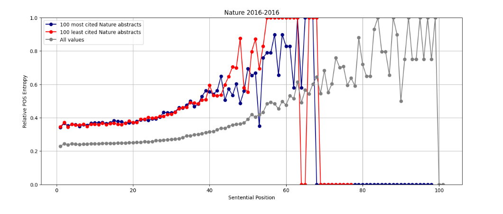

*Non-Nature: 100 most cited articles vs. 100 least cited articles*

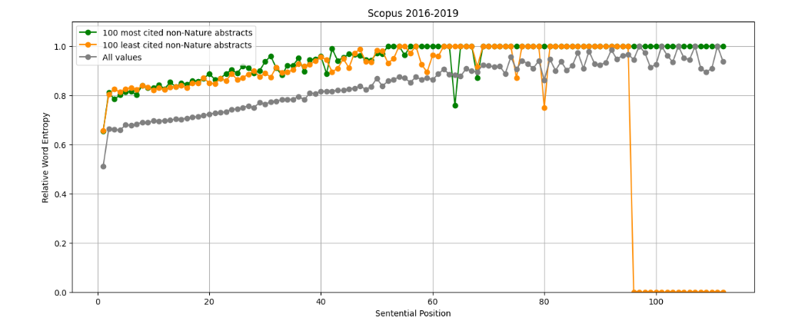
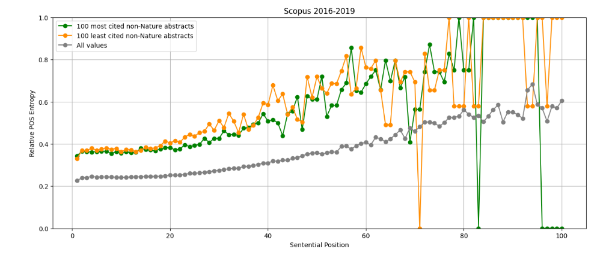

Non-Nature 2016-2019 (Scopus) and Nature 2016-2019

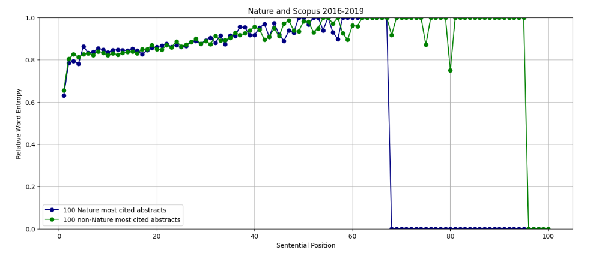
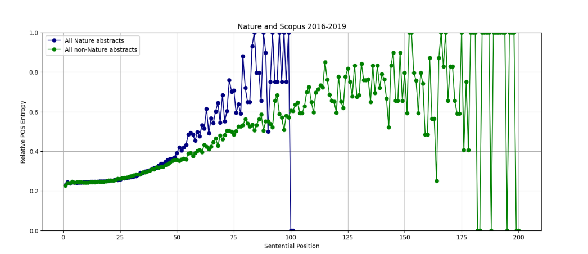
 
The plot above compares POS entropy for all abstracts from our datasets. It further explains the potential differences between the two datasets. It is important to note that the occurrences of very long sentences are rare, which is the reason for the diverging, unusual entropy values towards the last sentential positions. In the Scopus dataset, the longest sentences are twice as long as the longest Nature sentences, which is why the values for the Nature dataset start diverging much earlier than the ones for Scopus. The beginning of the plot is very uniform, showing an increasing trend that is consistent (and almost identical) for both datasets, up until the 50th word. This trend indicates that the structure of the sentences is similar throughout both of the datasets and it varies more depending on the length of the sentence.

The other plots in this section, both for Scopus and Nature, show a slow increase in word entropy and POS entropy with the sentential position. The values diverge towards the end of the plots, which most likely stems from the rarity of long sentences.

## Conclusions

### Entropy of abstracts:

The word-form and POS-form entropy values vary more in the Scopus (Non-Nature) dataset, compared to the abstracts published in Nature – that points to bigger differences between individual Scopus abstracts in terms of vocabulary richness and creativity. The Nature abstracts seem more uniform. This difference can be explained by the fact that the Scopus dataset contains abstracts from different journals, which means that they cover a wider variety of topics. The writing style of abstracts may differ between topics/fields of interest. Different journals may also have different admission criteria, which could further deepen the differences.
The differences between the most and least cited abstracts are not consistent and overall don’t point to any coherent conclusions. The most cited abstracts in the Nature dataset seem to be slightly more creative than the least cited. However, the sample might be too small to consider these results definite.

### Entropy on sentential positions:

The word-form and POS-form entropy on sentential positions are consistent throughout both datasets and very similar between the most and least cited abstracts. This dependency could be pointing towards the entropy of a whole abstract being the main factor contributing to vocabulary richness and creativity of a text, instead of the entropy of words or parts of speech on certain sentential positions.

To sum up, the hypotheses that we proposed weren’t confirmed, at least not fully (the difference observed in the Nature dataset in terms of creativity doesn’t seem to be conclusive). The research could be further improved by increasing the size of the sample.

## References

Chen, R., Liu, H., & Altmann, G. (2017). Entropy in different text types. Digital Scholarship in the Humanities, 32(3), 528–542. https://doi.org/10.1093/llc/fqw008

